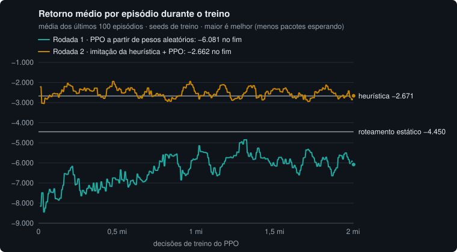

# Resultados medidos

Todos os números do projeto, por fase, com a forma de reproduzir cada um.
Nenhum foi estimado: vêm do motor de simulação, dos testes automatizados ou
de benchmarks que estão no repositório.

## Como foi medido

- **Máquina de desenvolvimento:** Windows 11, Node.js 24.21, Chromium
  (Playwright) com GPU dedicada (NVIDIA RTX 5060 Ti via ANGLE/Direct3D 11). Um
  notebook comum fica abaixo nos números de FPS, e por isso o app reduz a
  qualidade sozinho quando o FPS cai.
- **CI:** runners `ubuntu-latest` do GitHub Actions, Node 24.
- **Determinismo:** a mesma seed reproduz a mesma simulação. As comparações
  "com e sem" usam a mesma seed, então a demanda é idêntica nos dois lados.
- Tempos de execução (milissegundos, passos por segundo) variam um pouco entre
  rodadas; quando há mais de uma medição, os valores aparecem como faixa.

---

## Fase 1 — galpão 3D e fluxo de esteiras

### Fluxo

| O que                                                    | Resultado                                                                              |
| -------------------------------------------------------- | -------------------------------------------------------------------------------------- |
| Regime normal (3,6 pedidos/s), 6 min simulados           | 212 pacotes/min, tempo médio no sistema 31,6 s, fila ≈ 5, 1.156 entregues              |
| Capacidade de uma esteira (2,0 m/s, espaçamento 0,6 m)   | 3,33 pacotes/s                                                                         |
| Esteira mais carregada (E9, B3→B4)                       | 2,70 pacotes/s, 81% da capacidade (as duas linhas convergem nela)                      |
| Esteiras sem rota alternativa                            | 3 (A4→S1, B3→B4, B4→S2), verificado por teste                                          |
| Esteira da doca 3 parada por 2 min                       | fila de 0 → 428 pacotes; 8 min após o conserto, 109                                    |
| Mesma falha com a doca servindo 1,0 / 1,2 / 1,5 pacote/s | ritmo de escoamento idêntico: o limite é a folga da esteira mais carregada, não a doca |

### Desempenho

| O que                               | Resultado                                                                                         |
| ----------------------------------- | ------------------------------------------------------------------------------------------------- |
| Teste de carga                      | 2.288 pacotes desenhados a 60 FPS, qualidade alta                                                 |
| Mesmo teste com a CPU limitada a 4× | cai para qualidade média sozinho e volta a 60 FPS                                                 |
| Custo por quadro no teste de carga  | simulação 0,002 ms/passo · pacotes 0,19 ms · render 3,1 ms (alta), 1,1 ms (média), 1,0 ms (baixa) |
| Chamadas de desenho por quadro      | 294 (alta), 203 (média), 159 (baixa)                                                              |
| Otimização de chamadas de desenho   | 433 → 284 (anéis instanciados, peças dos caminhões mescladas)                                     |
| 5 reinícios seguidos                | geometrias e texturas na GPU estáveis (89 e 45)                                                   |
| Carregamento da demo publicada      | cena pronta em 1,9 s no primeiro acesso, 0,3 s com cache                                          |
| Testes automatizados ao fim da fase | 43                                                                                                |

---

## Fase 2 — frota de robôs, falhas e mapa de calor

### Segurança da frota (40 robôs)

Testes em `tests/fleet.test.ts`: 6 seeds × 10.000 passos com falhas injetadas
(esteira A4→S1 quebrada por 2 min, dois robôs com defeito, doca bloqueada),
mais um turno de 1.000 s com carga pesada.

| O que                                           | Resultado                                         |
| ----------------------------------------------- | ------------------------------------------------- |
| Menor distância entre centros de dois robôs     | 0,974 m (mínimo seguro: 0,89 m)                   |
| Frenagens acima do limite (2,5 m/s²)            | 0                                                 |
| Maior atraso de um robô em relação ao plano     | 0,50 s (a folga das reservas é de 1 s)            |
| Maior tempo de um robô sem conseguir planejar   | 15 s (com robôs em defeito no caminho)            |
| Tarefas no turno de 1.000 s                     | 246, com recargas de bateria e sem bateria zerada |
| Rotas aleatórias de um robô sozinho (pior caso) | 0,52 s de atraso (zigue-zague curto)              |

### Planejamento (Cooperative A\*)

`npm run bench:mapf`, 3 seeds × 10 min cada.

| O que                                  | Turno normal | Cenário duro¹ |
| -------------------------------------- | ------------ | ------------- |
| Tarefas concluídas                     | 459          | 467           |
| Planos                                 | 1.390        | 1.394         |
| Tentativas sem caminho                 | 18 (1,3%)    | 38 (2,7%)     |
| Tempo por plano, média                 | 0,72–0,74 ms | 1,10 ms       |
| Tempo por plano, p95                   | 1,62–1,71 ms | 6,0 ms        |
| Tempo por plano, máximo                | 28,9 ms      | 24,9 ms       |
| Estados expandidos por plano (média)   | 1.179        | 1.439         |
| Rota planejada ÷ caminho livre (média) | 1,07         | 1,12          |
| Menor distância entre robôs            | 0,979 m      | 0,973 m       |

¹ Falhas automáticas ligadas, 0,8 pedido de estoque/s (normal: 0,45) e 5
pedidos/s nas entradas (normal: 3,6).

**O que acontece numa tentativa sem caminho:**

| O que                                                | Turno normal  | Cenário duro                    |
| ---------------------------------------------------- | ------------- | ------------------------------- |
| Episódios (falhas seguidas até conseguir um caminho) | 5             | 9                               |
| Resolvidos na primeira nova tentativa                | 2             | 0                               |
| Duração média do episódio                            | 3,6 s         | 4,2 s                           |
| Episódio mais longo                                  | 10 s          | 9 s                             |
| Onde o robô esperava                                 | 18 em estação | 35 em estação, 3 em piso aberto |
| Em corredor estreito ou passagem sob esteira         | 0             | 0                               |
| Ainda sem caminho no fim da simulação                | 0             | 0                               |
| Pedidos para outro robô sair da frente               | 0             | 5                               |

### Correção que a medição revelou

A posse de uma estação era liberada quando o robô terminava a tarefa, mas ele
só sai da célula no passo seguinte; outros robôs eram mandados para lá e
falhavam ao planejar. Mesma medição, antes e depois:

| O que                          | Antes   | Depois  |
| ------------------------------ | ------- | ------- |
| Tentativas sem caminho         | 31%     | 1,3%    |
| Tempo por plano, média         | 6,96 ms | 0,72 ms |
| Tempo por plano, p95           | 22,4 ms | 1,62 ms |
| Rota planejada ÷ caminho livre | 1,11    | 1,07    |

### Desvio por robôs

A4→S1 quebrada por 3 min; mesma seed com e sem os robôs fazendo o desvio
(`tests/failures.test.ts`).

| Seed | Pico da fila (sem → com) | Entregas até o conserto (sem → com) | Entregas 2 min depois | Pacotes levados pelos robôs |
| ---- | ------------------------ | ----------------------------------- | --------------------- | --------------------------- |
| 2026 | 738 → 602 (−18%)         | 257 → 369 (+44%)                    | 833 → 984             | 78                          |
| 7    | 676 → 540 (−20%)         | 234 → 345 (+47%)                    | 829 → 977             | 90                          |
| 11   | 699 → 550 (−21%)         | 256 → 371 (+45%)                    | 847 → 999             | 78                          |

Os robôs levam cerca de 0,45 pacote/s pelo desvio; a esteira leva 1,8: o
desvio alivia, não substitui.

### Interface com a simulação num Web Worker

Teste de carga (mais de 2.000 pacotes), 40 robôs, velocidade 16×, falhas
automáticas, 15 s de medição. `?sim=main` roda a mesma simulação na thread da
página. Tarefas longas: Long Tasks API do Chromium (bloqueios acima de 50 ms).

| Cenário                              | Worker                                                        | Thread da página                                                                |
| ------------------------------------ | ------------------------------------------------------------- | ------------------------------------------------------------------------------- |
| Carga contínua                       | 0 tarefas longas, p99 do quadro 16,8 ms                       | 1 tarefa longa (65 ms), p99 33,3 ms                                             |
| Saltos de 2 min simulados a cada 3 s | 0 tarefas longas, pior quadro 16,8 ms, 60 FPS, qualidade alta | 8 tarefas longas (4,8 s), pior quadro 250 ms, 47 FPS, qualidade caiu para média |

### Mapa de calor

CPU gasta por quadro, média de 600 quadros (`__gemeo.benchHeat()` no console).

| Situação                           | Na GPU (posições + 2 passes) | Referência na CPU (splats + envio da textura) |
| ---------------------------------- | ---------------------------- | --------------------------------------------- |
| Normal (≈90 pacotes nas esteiras)  | 0,04–0,08 ms                 | 0,46–0,49 ms                                  |
| Teste de carga (≈187 nas esteiras) | 0,03–0,07 ms                 | 0,64–0,67 ms                                  |

Textura de 272 × 160 texels (4 por metro).

### Desempenho e memória

| O que                               | Resultado                                                               |
| ----------------------------------- | ----------------------------------------------------------------------- |
| Teste de carga com a frota          | 2.369 pacotes desenhados + 40 robôs a 60 FPS, qualidade alta, com bloom |
| 5 reinícios seguidos                | geometrias 104 → 103, texturas 61 → 59 (sem crescer)                    |
| Build de produção                   | JS principal 680 kB (179,8 kB gzip); worker da simulação 52,5 kB        |
| Testes automatizados ao fim da fase | 103                                                                     |

### Benchmark do motor

`npm run bench` (Node, aquecimento descartado, mediana de 5).

| Caso                      | Máquina local                      | CI, 5 execuções (média e variação)      |
| ------------------------- | ---------------------------------- | --------------------------------------- |
| Motor sem robôs           | 941 mil passos/s                   | 676 mil passos/s, ±8,9% (amplitude 23%) |
| Motor com 40 robôs        | 4.086 passos/s (≈68× o tempo real) | 3.677 passos/s, ±11,4% (amplitude 30%)  |
| Teste de carga + 40 robôs | 3.956 passos/s                     | 3.584 passos/s, ±11,8% (amplitude 32%)  |
| Snapshot com 40 robôs     | 0,27 ms                            | 0,31 ms, ±10,4% (amplitude 29%)         |

**Ruído da comparação no mesmo runner (teste A/A, mesmo código duas vezes,
5 execuções):** pior diferença de 1,8%, 3,4% e 2,3% nos três casos de passos
por segundo, e 8,5% no snapshot. Por isso o CI bloqueia regressões acima de 10%
nos passos por segundo (com uma segunda rodada de confirmação antes de
falhar) e só avisa no snapshot.

---

## Fase 3 — viagem no tempo e observabilidade

### Vigia anti-travamento

Cenários montados de propósito no mapa real (`src/sim/scenarios.ts`), nos 4
portões que são a única entrada das faixas de doca (1 célula entre duas paredes
de esteira, o corredor mais estreito que os robôs usam). Depois de 6 s sem
caminho, o vigia monta o grafo de quem espera quem; num ciclo, testa um recuo
para cada robô e manda recuar o que sai da frente mais rápido; atrás de um robô
com defeito, troca a entrega para a outra baia da mesma doca, se ela puder ser
alcançada.

**Dois robôs parados esperando um pelo outro, pedidos de passagem falhando**
(desligados de propósito). 4 portões × 3 posições (em volta do portão ou um
deles dentro) × 3 cargas (os dois vazios, um ou outro carregado) = 36 casos:

| O que                                 | Sem vigia                          | Com vigia |
| ------------------------------------- | ---------------------------------- | --------- |
| Casos travados                        | 36 de 36 (nenhum se move em 2 min) | 0 de 36   |
| Tempo até os dois passarem, pior caso | —                                  | 18,6 s    |
| Tempo até os dois passarem, mediana   | —                                  | 18,6 s    |
| Menor distância entre robôs           | —                                  | 1,000 m   |
| Frenagens acima do limite             | —                                  | 0         |

Os 18,6 s são 6 s até o vigia agir, o recuo (3 a 4 passos), a espera de 4 s de
quem recuou e a volta dele. O teste exige no máximo 20 s em todos os casos. O
mesmo vale para uma troca de lugares (cada robô quer a célula onde o outro
está): sem vigia, os dois seguem parados depois de 89 s; com vigia, espera
máxima de 6 s (o teste exige até 7 s).

**Robô com defeito dentro do portão por 60 s.** Um robô fica preso na faixa
atrás dele; dois precisam entregar em docas cuja baia mais próxima fica atrás do
portão (cada uma tem uma segunda baia, alcançada por outro caminho). Igual nos 4
portões:

| Espera máxima                      | Sem vigia | Com vigia                  |
| ---------------------------------- | --------- | -------------------------- |
| Robô preso atrás do defeito        | 60 s      | 60 s (o tempo do conserto) |
| Robôs com outra baia para entregar | 60 s      | 7 s                        |

Para o robô preso não há o que fazer: o único caminho passa pelo robô quebrado,
e a espera fica limitada pelo conserto (40 a 60 s no injetor de falhas). Num
portão que tem outro ao lado (as passagens sob as linhas principais), ninguém
espera: o planejador já contorna pelo outro.

**Custo de uma tentativa sem caminho** (robô preso atrás de um robô parado):

| O que                                 | Só a busca no espaço-tempo | Com a prova no piso |
| ------------------------------------- | -------------------------- | ------------------- |
| Uma tentativa (duas rodadas)          | 19,0–19,9 ms               | 0,0019–0,002 ms     |
| CPU dos 36 casos de impasse com vigia | 11,8 s                     | 1,8 s               |

A prova trata como parede as células que outro robô já segura (elas não abrem
durante a busca) e faz uma busca em largura no piso. Ela ignora o tempo e as
regras de movimento, então nunca recusa um caminho que a busca acharia: um
teste compara as duas respostas em 400 casos aleatórios (191 com caminho, 209
sem), com 0 diferenças. No turno normal e no cenário duro (`npm run bench:mapf`)
os resultados ficaram idênticos aos da Fase 2 e o benchmark do motor ficou
dentro do ruído (−1,2% a +2,6%).

### Viagem no tempo

Uma hora simulada com 40 robôs e falhas automáticas (`npm run bench:tempo`,
seed 2026, Node 24, mesma máquina das outras medições):

| O que                                        | Resultado                                                 |
| -------------------------------------------- | --------------------------------------------------------- |
| Checkpoints (a cada 30 s simulados)          | 121; média 122 KB, máximo 172 KB                          |
| Tempo para gravar um checkpoint              | mediana 1,2 ms, máximo 23 ms                              |
| Memória da gravação                          | 15,5 MB por hora (14,5 MB de checkpoints)                 |
| Voltar a um instante sorteado (60 sorteios)  | mediana 253 ms, p95 484 ms, máximo 580 ms                 |
| Mesmo instante refazendo tudo desde o tick 0 | 34 s na meia hora, 65 s no fim da hora (≈255× mais lento) |

Numa execução curta e caótica (120 s, falhas automáticas, 0,6 pedido de estoque/s
e 4,5 pedidos/s nas entradas), um checkpoint tem 82 KB (`tests/checkpoint.test.ts`);
numa hora com falhas, as filas crescem e com elas o checkpoint.

Antes da codificação compacta das filas de entrada, os checkpoints tinham 211 KB
em média (326 KB no máximo) e a gravação ocupava 26 MB por hora: 3.595 dos 4.833
pacotes do maior checkpoint esperavam nas entradas, ainda com os valores de
criação, e passaram de 60 para 16 bytes cada.

**Reconstrução idêntica** (`tests/checkpoint.test.ts`, `tests/recorder.test.ts`):
restaurado em 48 instantes de duas execuções caóticas (a cada 10 s, com
caminhões carregando, robôs com defeito e falhas automáticas) e em 48 instantes
de esperas resolvidas pelo pedido de passagem e pelo vigia, o mundo continua
igual ao original: impressão digital, bytes do snapshot e estatísticas da
frota. Voltar a 30 instantes sorteados de uma gravação com falhas manuais e
automáticas e teste de carga mostra exatamente o estado que o mundo tinha ao vivo.
Continuar a partir do passado com uma entrada nova dá o mesmo que uma execução
nova com as mesmas entradas. Onze campos esquecidos de propósito na codificação
(posição anterior do pacote, soma da janela de métricas, sorteio de pedidos,
início de um hold, espera de um robô, pausa depois de sair da frente, início da
falha de planejamento, velocidade, próximo sorteio de falha, carga do caminhão,
rodízio das junções) foram todos pegos pelos testes.

**Sem vazamento em 50 viagens no tempo:**

| Onde                                  | Antes                       | Depois                      |
| ------------------------------------- | --------------------------- | --------------------------- |
| GPU (Chromium, 50 viagens, 5 ramos)   | 101 geometrias, 62 texturas | 101 geometrias, 62 texturas |
| Heap da página (após coleta forçada)  | 12,98 MB                    | 13,23 MB                    |
| Heap da simulação, 60 viagens         | —                           | +0,77 MB (caches aquecendo) |
| Heap da simulação, mais 60 viagens    | —                           | +0,03 MB                    |
| Bytes da gravação (teste, 50 viagens) | iguais                      | iguais; só 2 mundos em uso  |

**Custo de gravar no motor ao vivo** (`npm run bench`, mediana de 5): 4.231
passos/s rodando pela gravação contra 4.210 passos/s do motor sozinho, dentro do
ruído entre repetições (1,1% a 1,8%).

### Indicadores do painel de operação

Calculados no worker para o instante mostrado (ao vivo ou passado), a partir de
uma amostra por segundo com contadores acumulados: uma janela é uma subtração.

- **Vazão:** entregas no último minuto (no começo da execução, as entregas até
  ali; nunca extrapola um trecho curto).
- **Tempo de ciclo médio e p95:** sobre todas as entregas dos últimos 5 min,
  do pedido à doca. O p95 é exato (seleção, posto mais próximo); um teste o
  compara com a ordenação completa em 300 conjuntos aleatórios com empates.
- **Utilização:** esteira = pacotes que saíram ÷ capacidade (velocidade ÷
  espaçamento); doca = entregas ÷ taxa de serviço; robô = fração do tempo
  buscando, carregando, entregando ou descarregando.
- **Alerta de robô travado:** 20 s sem caminho geram um evento e o alerta
  vermelho na cena; quando ele volta a planejar, outro evento diz quanto esperou.
  No robô preso atrás de um robô quebrado no portão, o alerta sai entre 20 e 22 s
  depois da primeira falha de planejamento e o retorno diz "voltou a andar após
  60 s" (`tests/watchdog.test.ts`).

**Cores dos gráficos.** Os estados dos robôs usam os tons da cena (ciano
trabalhando, âmbar recarregando, vermelho com defeito, cinza ocioso), escurecidos
para a faixa de luminosidade de gráficos sobre o painel escuro (`#10161d`) e
conferidos com o validador de paleta (simulação de daltonismo): na ordem defeito,
trabalhando, recarregando, ociosos, o par vizinho mais parecido fica a ΔE 10,3
para daltonismo (mínimo recomendado 8) e 19,6 para visão normal (mínimo 15). As
cores da marca, sem escurecer, saíam da faixa de luminosidade; na ordem com âmbar
ao lado do vermelho, o par caía para ΔE 13,7 (visão normal), abaixo do mínimo. O
cinza dos ociosos tem croma baixo de propósito (é o tom de fundo). Os três
indicadores dos últimos 5 minutos têm escalas diferentes e ficam em três gráficos
pequenos, cada um com o próprio eixo.

### Conferência por mutação

`npm run mutate` (todas as especificações de `mutations/`)
aplica cada mutação numa cópia temporária do código (nunca nos arquivos do
repositório) e roda os testes daquela parte:

| Especificação | O que muda de propósito                                                                                         | Pegas pelos testes |
| ------------- | --------------------------------------------------------------------------------------------------------------- | ------------------ |
| vigia         | ciclos e desvios do vigia, escolha de quem recua, pedido de passagem, alerta de travado, prova de "sem caminho" | 9 de 9             |
| checkpoint    | um campo esquecido na codificação                                                                               | 11 de 11           |
| gravador      | entradas no tick do checkpoint, cortes da ramificação, p95, teste de carga no reinício                          | 10 de 10           |

A execução completa leva cerca de 5 min. Interrompida à força no meio de uma
mutação, a árvore de trabalho ficou idêntica (`git status` e `git diff`); só a
cópia temporária sobrou, e a primeira execução depois de uma hora a apaga.

### No CI e no navegador

**Benchmark do motor no PR da Fase 3** (mesmo runner, base = `main` da Fase 2):

| Caso                                 | Base    | Fase 3  | Diferença            |
| ------------------------------------ | ------- | ------- | -------------------- |
| Motor sem robôs (passos/s)           | 645.579 | 642.207 | −0,5%                |
| Motor com 40 robôs (passos/s)        | 3.347   | 3.403   | +1,7%                |
| Motor gravando, 40 robôs (passos/s)  | —       | 3.396   | caso novo            |
| Teste de carga + 40 robôs (passos/s) | 3.266   | 3.309   | +1,3%                |
| Snapshot com 40 robôs (ms)           | 0,343   | 0,352   | −2,7% (só relatório) |

**Chromium:** ao vivo → passado (efeito aplicado por completo, "Revendo o
passado") → histórico por clique → continuar daqui, também com a simulação na
thread da página (`?sim=main`), sem erros no console. O único aviso de shader
(compilador do Direct3D) já aparecia na Fase 2.

**Testes:** 141 em 18 arquivos ao fim da fase (103 ao fim da Fase 2).

---

## Fase 4 — IA de operações

### Como as políticas de roteamento foram comparadas

Quatro cenários de 10 minutos simulados, o primeiro minuto descartado (o
galpão enchendo): **normal**; **esteira com alternativa quebrada** (Esteira 3,
A2→A3, aos 120 s e Esteira 8, B2→B3, aos 330 s, 60 a 90 s cada); **pico de
pedidos** (demanda 22% acima do normal e dois picos de 2,5× por 45 s); **falhas
automáticas**. Só contam os pacotes que entram pelas esteiras: os pedidos de
estoque vão do rack à doca por robô, sem passar por nenhuma escolha, e o ciclo
deles (p95 de 128 s contra 37 s nas esteiras) esconderia o efeito. Cada
política roda as mesmas seeds com os mesmos pedidos; os ganhos são pareados
seed a seed, com intervalo de confiança de 95% (t de Student, 9 graus de
liberdade). "Idade máxima" é a idade do pacote mais velho ainda no galpão, no
pior momento do episódio.

Seeds: treino 10.001 a 19.999 (episódios do PPO e demonstrações da imitação),
validação 20.001 a 20.010 (calibração da heurística e do detector, julgamento
das rodadas da IA), teste 30.001 a 30.010 (uma única vez, no resultado final;
os benchmarks recusam sem `--final`).

### Heurística contra o roteamento estático (seeds de validação)

`npm run bench:rotas`, parâmetros da heurística: peso da fila 0,5, escala 0,5 s,
suavização 0,3.

| Cenário                          | p95 do ciclo (estática → heurística) | ganho no p95 (IC 95%)    | seeds melhores | ganho no p99 | idade máxima (estática → heurística) | vazão  |
| -------------------------------- | ------------------------------------ | ------------------------ | -------------- | ------------ | ------------------------------------ | ------ |
| Normal                           | 37,4 s → 36,7 s                      | +1,7% (+1,2% a +2,1%)    | 10 de 10       | +3,3%        | 42,7 s → 41,0 s                      | +0,0%  |
| Esteira com alternativa quebrada | 107,6 s → 46,5 s                     | +56,6% (+53,7% a +59,5%) | 10 de 10       | +11,0%       | 120,1 s → 115,8 s                    | +4,1%  |
| Pico de pedidos                  | 184,3 s → 121,6 s                    | +34,0% (+31,0% a +36,9%) | 10 de 10       | +28,9%       | 211,0 s → 151,8 s                    | +11,5% |
| Falhas automáticas               | 210,1 s → 163,6 s                    | +21,5% (+13,7% a +29,2%) | 10 de 10       | +17,2%       | 340,8 s → 337,0 s                    | +9,5%  |

**Calibração** (`npm run bench:rotas -- --calibrate`, grade 3 × 3): ganho médio
no p95 entre +26,9% e +28,4% em todas as combinações; a escolhida (peso 0,5,
escala 0,5 s) foi a melhor. O ótimo é plano, então a escolha não é frágil.

**A heurística nos cinco níveis do agente** (`--teacher`: frações arredondadas
para 0, ¼, ½, ¾ ou 1, como o agente decide). É o professor da imitação da
rodada 2, e mede igual à heurística contínua (todos os intervalos incluem 0):
o espaço de ação do agente não é o que limita.

| Cenário                          | ganho no p95 sobre a heurística (IC 95%) | seeds melhores |
| -------------------------------- | ---------------------------------------- | -------------- |
| Normal                           | −0,0% (−0,1% a +0,1%)                    | 5 de 10        |
| Esteira com alternativa quebrada | +0,1% (−0,4% a +0,5%)                    | 4 de 10        |
| Pico de pedidos                  | −0,4% (−1,9% a +1,1%)                    | 4 de 10        |
| Falhas automáticas               | +1,0% (−1,0% a +3,0%)                    | 7 de 10        |

### Agente de reforço (PPO): rodadas de ajuste nas seeds de validação

**Critério de sucesso, fixado antes de treinar** (contra a heurística, pares
seed × cenário): p95 do ciclo melhor em pelo menos 7 de cada 10 pares; ganho
médio no p95 de pelo menos 3% com o IC 95% acima de 0; sem perda de vazão; em
nenhum cenário o p95 significativamente pior; nem o p99 nem a idade máxima de um
pacote significativamente piores, no total ou em algum cenário. Prazo: até 3
rodadas de ajuste de no máximo 2 milhões de decisões cada. Recompensa por
segundo: −(0,01 × pacotes no galpão + 0,05 × pacotes com mais de 60 s); ação: um
nível de 0 a 4 por escolha (fração = nível ÷ 4); observação: 93 valores
(ocupação e fila de cada esteira, desvios por robô, filas de entrada, frações
atuais, pico de pedidos, docas bloqueadas).

Retorno médio de referência por episódio (a mesma recompensa, 40 seeds de
treino por cenário, `bench/retornos.ts`): estática −4.450, heurística −2.671.



**Rodada 1: PPO a partir de pesos aleatórios** (2M decisões, 69,7 min, 478
decisões/s, 16 ambientes, taxa 3e-4, entropia 0,01). Retorno de treino nos últimos
200 episódios: −5.827, pior que o estático. A política aleatória do começo espalha pacotes ao
acaso a cada segundo, e 2M decisões não bastaram nem para chegar ao estático.

| Cenário                          | p95 (heurística → agente) | ganho no p95 (IC 95%)       | seeds melhores |
| -------------------------------- | ------------------------- | --------------------------- | -------------- |
| Normal                           | 36,7 s → 45,2 s           | −23,0% (−24,0% a −22,0%)    | 0 de 10        |
| Esteira com alternativa quebrada | 46,5 s → 116,6 s          | −152,0% (−176,7% a −127,3%) | 0 de 10        |
| Pico de pedidos                  | 121,6 s → 194,2 s         | −60,1% (−69,7% a −50,5%)    | 0 de 10        |
| Falhas automáticas               | 163,6 s → 218,2 s         | −35,5% (−53,8% a −17,2%)    | 0 de 10        |

No total, −67,6% (IC −85,6% a −49,7%), 0 de 40 pares: nenhum item do critério.

**Rodada 2: imitação da heurística + PPO.** A rede começa imitando o professor
(a heurística nos cinco níveis do agente, que mede igual à heurística): 400
episódios em seeds de treino, 216 mil passos, 189 s; em episódios separados ela
acerta 97,7% dos níveis e as cinco escolhas de uma vez em 90,2% dos segundos.
Depois, 10 atualizações só do crítico e PPO por 2M decisões (69,0 min, 483
decisões/s; taxa 1e-4, entropia 0,001, clip 0,1). Retorno de treino nos últimos
200 episódios: −2.746 (heurística: −2.671).

| Cenário                          | Só imitada: ganho no p95 (IC 95%) | seeds melhores | Imitação + PPO: ganho no p95 (IC 95%) | seeds melhores |
| -------------------------------- | --------------------------------- | -------------- | ------------------------------------- | -------------- |
| Normal                           | +0,0% (−0,1% a +0,2%)             | 4 de 10        | +0,1% (−0,0% a +0,1%)                 | 7 de 10        |
| Esteira com alternativa quebrada | +0,4% (−0,1% a +0,8%)             | 7 de 10        | −0,2% (−0,4% a +0,1%)                 | 3 de 10        |
| Pico de pedidos                  | +4,1% (+2,4% a +5,9%)             | 9 de 10        | +3,9% (+2,3% a +5,6%)                 | 9 de 10        |
| Falhas automáticas               | +1,8% (+0,2% a +3,5%)             | 7 de 10        | +3,2% (+0,1% a +6,3%)                 | 7 de 10        |
| **Total (40 pares)**             | **+1,6% (+0,8% a +2,3%)**         | **27 de 40**   | **+1,8% (+0,8% a +2,7%)**             | **26 de 40**   |

| Item do critério                        | Só imitada  | Imitação + PPO |
| --------------------------------------- | ----------- | -------------- |
| p95 melhor em pelo menos 28 de 40 pares | não (27)    | não (26)       |
| ganho médio ≥ 3% com IC acima de 0      | não (+1,6%) | não (+1,8%)    |
| sem perda de vazão                      | sim (+0,3%) | sim (+0,2%)    |
| p95 não piora em nenhum cenário         | sim         | sim            |
| p99 não piora                           | sim (+1,8%) | sim (+2,4%)    |
| idade máxima não piora                  | sim (+3,0%) | sim (+3,2%)    |

As duas **quase passaram**: cumprem 7 dos 9 itens e ficam abaixo dos dois
limiares de ganho, que não mudam. O PPO acrescentou +0,2 ponto à imitação no
ganho médio, dentro do ruído. Os ganhos se concentram nos cenários congestionados
(pico, falhas automáticas), onde a idade máxima de um pacote também cai (152 → 141
s no pico, 337 → 303 s nas falhas).

**A rede só imitada é reproduzível bit a bit.** Refazer as demonstrações e a
imitação do zero dá o mesmo ONNX, byte a byte (sha256 `c5e09a8c37a33bf2`), o
que foi conferido em três execuções independentes:
`ai/.venv/Scripts/python ai/check_imitation.py` (cerca de 3 min, código de saída
1 se diferir). Paridade ONNX × PyTorch das três redes: diferença máxima de
1,9e-6 nos logits, mesmas ações.

**Por que a imitada supera o próprio professor? Não explicado.** A hipótese era
que a rede suaviza as decisões e oscila menos no congestionamento
(`npm run bench:oscilacao`, por minuto simulado, somando as 5 escolhas, média de
10 seeds):

| Cenário                          | Mudanças de nível por minuto: professor → só imitada → imitação + PPO | Heurística com suavização 0,15 |
| -------------------------------- | --------------------------------------------------------------------- | ------------------------------ |
| Normal                           | 2,4 → 1,9 → 3,4                                                       | 0,4                            |
| Esteira com alternativa quebrada | 8,0 → 6,4 → 8,0                                                       | 4,9                            |
| Pico de pedidos                  | 31,0 → 24,6 → 24,2                                                    | 16,5                           |
| Falhas automáticas               | 25,4 → 19,8 → 21,9                                                    | 13,8                           |

A imitada oscila cerca de 20% menos que o professor no congestionamento, mas isso
não acompanha o ganho seed a seed (Pearson −0,41 no pico, +0,13 nas falhas). O
**teste causal**, só como análise (a heurística oficial não mudou): com
suavização 0,15 em vez de 0,3, a heurística passa a mexer na divisão bem menos que
a imitada, e o p95 não melhora em nenhum cenário (normal −0,0%, pico −0,1%,
falhas −0,3%, todos com IC incluindo 0; esteira −0,7%, IC −1,1% a −0,3%).
Oscilar menos não produz o ganho.

**Candidata principal para as seeds de teste** (registrada em 2026-10-06, antes de
qualquer uso das seeds de teste, só com a validação): **a rede da rodada 2
(imitação + PPO)**. Motivos: maior ganho médio no p95 na validação (+1,8% contra
+1,6% da só imitada), melhor p99 (+2,4% contra +1,8%) e melhor idade máxima
(+3,2% contra +3,0%), sem piora significativa em nenhum cenário; e é o método
completo da rodada (a só imitada é a comparação declarada, para medir o que o
PPO acrescentou). Nenhuma das duas cumpriu o critério na validação, então a
expectativa é que a heurística continue sendo a política oficial. A passada única
nas seeds de teste mede as 4 políticas juntas (estática, heurística, só imitada e
imitação + PPO), com o critério aplicado sem mudança às duas redes. A rodada 3
não foi usada: o PPO acrescentou +0,2 ponto à imitação em 2M decisões, longe dos
limiares.

**Política oficial: heurística, decidida na validação.** A passada no teste é só
para reportar os números finais das 4 políticas e do detector; o resultado do
teste não muda essa decisão. (Registrado em 2026-10-06, antes de rodar o teste.)

<!-- TESTE -->

### Manutenção preditiva (sinais simulados)

> Vibração e temperatura vêm de um modelo simples, não de máquinas reais.
> Os números abaixo medem o detector nesse modelo.

`npm run bench:manutencao`: cada seed roda 30 minutos de falhas automáticas uma
vez; os escores de cada segundo ficam guardados, e a grade de k e h reaplica o
CUSUM sobre eles sem simular de novo. Os alarmes que o próprio motor levantou
batem exatamente com essa reaplicação (o benchmark confere e falha se não
baterem). Um alarme é verdadeiro quando sobe enquanto aquela esteira está se
desgastando; uma quebra conta como detectada quando um alarme subiu durante o
desgaste dela (alarme já aceso antes do início não conta).

**Seeds de validação, k = 3, h = 48** (10 seeds × 30 min = 5 h simuladas, 24
motores):

| O que                                 | Resultado                                                                                            |
| ------------------------------------- | ---------------------------------------------------------------------------------------------------- |
| Precisão                              | 98% (50 de 51 alarmes)                                                                               |
| Recall das quebras com desgaste       | 77% (48 de 62)                                                                                       |
| Recall de todas as quebras de esteira | 56% (48 de 86; 24 foram súbitas, sem aviso)                                                          |
| Antecedência (do alarme à quebra)     | mediana 36 s, p10 10 s                                                                               |
| Alarmes falsos                        | 1 em 5 h simuladas: 0,2 por hora no CD inteiro (≈ 0,01 por motor-hora); aconteceu durante um enrosco |

**Calibração** (grade 7 × 8, ordenada por F1): k = 3, h = 48 deu F1 0,87; com
k = 2 e h = 64, recall 94% mas precisão 77%; com k = 4 e h = 24, precisão 98%,
recall 73%. k e h grandes fazem o alarme esperar a anomalia durar mais que um
enrosco típico, que é o que mantém os alarmes falsos raros.

**O que fica sem aviso** (as 14 quebras com desgaste não detectadas): desgastes
que aparecem forte em **um sinal só** (vibração sem aquecimento, ou o contrário)
e em geral **rápidos**. Com k = 3 e o z de cada sinal limitado a 4, um sinal
sozinho soma no máximo 4/√2 ≈ 2,83 por segundo, abaixo de k: a soma nunca
acumula. É o preço de ignorar pancadas (só vibração) e enroscos curtos.

| Força do desgaste no sinal mais fraco | Detectadas | Duração do desgaste | Detectadas |
| ------------------------------------- | ---------- | ------------------- | ---------- |
| menor que 0,4                         | 20 de 34   | 60 a 100 s          | 13 de 22   |
| de 0,4 a 0,8                          | 15 de 15   | 100 a 140 s         | 19 de 23   |
| 0,8 ou mais                           | 13 de 13   | 140 a 180 s         | 16 de 17   |

Mediana da força no sinal mais fraco: 0,14 nas perdidas, 0,50 nas detectadas;
duração mediana: 84 s nas perdidas, 128 s nas detectadas.

**Medido ao construir o detector** (mesmas seeds):

| Versão do detector                                     | Resultado                                                                                            |
| ------------------------------------------------------ | ---------------------------------------------------------------------------------------------------- |
| Modelo nominal fixo do motor                           | melhor F1 0,75 (precisão 64%), ótimo na borda da grade                                               |
| + filtro de Kalman que aprende o normal de cada motor  | precisão até 69%: todos os 29 alarmes falsos (k = 1, h = 8, 4 seeds) de 2 a 16 s depois de um reparo |
| + ressincronizar a temperatura quando o motor religa   | 100% de precisão e de recall: o problema tinha ficado fácil demais                                   |
| + quebras súbitas, desgaste fraco, pancadas e enroscos | o compromisso real acima (ótimo no meio da grade)                                                    |

### Treino no mesmo motor

| O que                                                   | Resultado                                                                              |
| ------------------------------------------------------- | -------------------------------------------------------------------------------------- |
| Episódio de 10 min (40 robôs), motor compilado pelo tsx | 11 s                                                                                   |
| O mesmo, build do esbuild sem `keepNames`               | 1,9 s (5,7×), mesmos resultados bit a bit                                              |
| Ida e volta do protocolo binário (Python ↔ Node)        | 0,05 ms                                                                                |
| Decisões por segundo no treino (16 ambientes)           | cerca de 490                                                                           |
| Fidelidade Python ↔ TypeScript                          | mesma impressão digital, medidas e recompensas (cenários esteira e falhas automáticas) |

Por que não escala mais: 8 processos simulando ao mesmo tempo ficam 2,4× mais
lentos cada (cache e memória da máquina), e o passo em lote espera o ambiente
mais lento a cada decisão.

### O agente no app

| O que                                        | Resultado                                                       |
| -------------------------------------------- | --------------------------------------------------------------- |
| Uma decisão no Node (onnxruntime-web, WASM)  | 0,03 ms de inferência + 0,003 ms para montar a observação       |
| Código do worker                             | 101 kB (89 kB na Fase 3)                                        |
| Runtime da rede, baixado só ao escolher a IA | 71 kB de JavaScript + 14,2 MB de WebAssembly (3,7 MB com gzip)  |
| Paridade ONNX × PyTorch                      | mesmos logits até 1e-4 e mesmas ações em 8 observações de prova |

O WebAssembly é a variante só de CPU: a variante com WebGPU tinha 28 MB, e uma
rede de 128 × 128 não precisa de GPU. O worker passou a ser um módulo ES; antes
ele embutia o runtime inteiro (510 kB) porque o formato IIFE não separa
importações dinâmicas.

### Conferência por mutação

| Especificação | O que muda de propósito                                                                                   | Pegas pelos testes |
| ------------- | --------------------------------------------------------------------------------------------------------- | ------------------ |
| manutenção    | desgaste antes das quebras, sinais, ressincronização, aprendizado do filtro, teto do z, CUSUM, checkpoint | 9 de 9             |

Com as especificações anteriores: 39 de 39, em 14 minutos (com o treino da IA
rodando ao mesmo tempo). Uma rodada que passa de 5× o tempo da linha de base é
encerrada e conta como pega: um mutante tinha transformado uma espera num laço
infinito.

---

## Bugs que só apareceram medindo

| Fase | Sintoma medido                                                     | Causa                                                            | Efeito da correção                                          |
| ---- | ------------------------------------------------------------------ | ---------------------------------------------------------------- | ----------------------------------------------------------- |
| 1    | Fila de entrada crescendo em regime normal (297 pacotes em 15 min) | esteira E9 recebendo 2,7 pacotes/s com capacidade de 2,46        | esteiras a 2,0 m/s: E9 a 81%, fila estável                  |
| 1    | +1 textura na GPU a cada reinício                                  | só a textura do ambiente era liberada, não o render target       | memória estável em 5 reinícios                              |
| 1    | 433 chamadas de desenho por quadro                                 | um objeto por anel e por peça de caminhão                        | 284                                                         |
| 1    | CPU 4× mais lenta ficava em 49–51 FPS sem reduzir qualidade        | alvo do ajuste automático em 50 FPS                              | alvo 55: cai para média e volta a 60 FPS                    |
| 2    | Frenagens acima do limite ao alcançar a referência                 | curva de frenagem contínua avaliada tick a tick                  | curva discreta e checagem da referência futura: 0 violações |
| 2    | Frenagem brusca logo após replanejar                               | o novo plano mudava a curva na célula seguinte                   | compromisso 2 passos à frente: 0 violações em 8 seeds       |
| 2    | Exceção "célula já reservada"                                      | robô precisando parar numa célula que outro reservaria no futuro | esse outro também replaneja                                 |
| 2    | 31% das tentativas de planejamento sem caminho                     | estação liberada com o robô ainda em cima                        | 1,3%, e plano 10× mais rápido                               |
| 3    | Os dois robôs de um par recuavam ao mesmo tempo                    | cada um pedia passagem ao outro na mesma rodada                  | só um recua (teste)                                         |
| 3    | Robôs saindo da frente à toa atrás de um robô com defeito          | o pedido de passagem passava por quem não podia se mover         | nenhum pedido nesses casos (teste)                          |
| 3    | 36 casos de impasse custando 11,8 s de CPU                         | cada tentativa sem caminho esgotava 60 mil estados da busca      | prova no piso: 1,8 s; ~20 ms → ~0,002 ms por tentativa      |
| 3    | Robô restaurado divergindo no último bit                           | a soma da janela de métricas era recalculada ao compactar        | compactação sem recálculo: idêntico bit a bit               |
| 3    | Checkpoints de 211 KB (326 KB no máximo) numa hora com falhas      | pacotes parados nas entradas gravados com todos os campos        | 16 bytes por pacote intacto: média 122 KB, máximo 172 KB    |
| 3    | Teste de carga perdido ao reiniciar (teste do worker)              | a carga virou entrada gravada e o reinício criava gravação nova  | a carga volta como entrada no tick 0 da nova gravação       |
| 4    | Treino a 170 decisões/s (2M em 3,3 h)                              | o tsx (keepNames) gastava ~75% do episódio num ajudante          | build com esbuild: ~490/s, 2M em cerca de 70 min            |
| 4    | Detector com 20% a 69% de precisão                                 | modelo fixo do motor: viés de cada motor e da carga              | filtro de Kalman aprende o normal de cada motor             |
| 4    | 29 de 29 alarmes falsos logo depois de um reparo                   | o motor que quebrou gasto volta quente (memória térmica)         | o gêmeo ressincroniza a temperatura quando o motor religa   |
| 4    | 100% de precisão e de recall                                       | desgaste sempre forte e nenhum distúrbio no modelo dos sinais    | quebras súbitas, desgaste fraco, pancadas e enroscos        |
| 4    | Conferência por mutação parada por mais de 7 min                   | mutante transformou "espere um desgaste" em laço infinito        | teste com limite; rodada encerrada em 5× a linha de base    |
| 4    | Worker de 89 kB → 510 kB                                           | o formato IIFE embutia o runtime da rede no import dinâmico      | worker em módulo ES: 101 kB, runtime baixado sob demanda    |

## Como reproduzir

```bash
npm test             # segurança da frota, desvio, falhas, determinismo
npm run bench        # benchmark do motor
npm run bench:mapf   # planejamento e episódios sem caminho
npm run bench:vigia  # impasses e defeitos em corredor estreito, com e sem vigia
npm run bench:tempo  # uma hora simulada: memória, checkpoints e seek (cerca de 3 min)
npm run bench:rotas  # roteamento: estática × heurística (--rl <modelo> inclui o agente, --teacher o professor)
npm run bench:manutencao  # detector de manutenção preditiva (--calibrate: grade de k e h)
npm run mutate       # conferência por mutação numa cópia temporária (~10 min)
ai/.venv/Scripts/python ai/test_fidelity.py   # o Python e o TypeScript simulam igual
ai/.venv/Scripts/python ai/train.py --name x  # treino PPO (ver o README)
npm run dev          # depois, no console do navegador: __gemeo.benchHeat()
```

As medições de interface (tarefas longas, FPS, memória) usaram o Chromium
via Playwright; `?sim=main` liga a simulação na thread da página para a
comparação.
